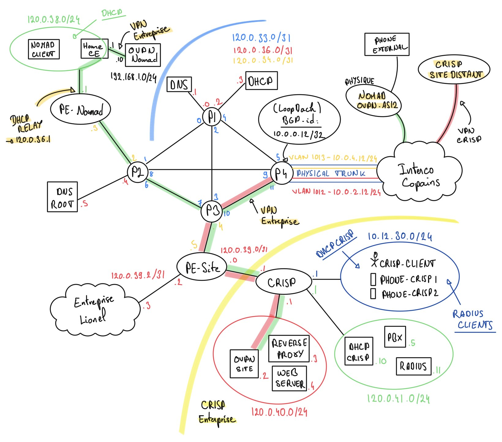

# CrISP - A Container-running Internet Service Provider


> Multi-site enterprise network project with internal routing, interconnection with other autonomous systems, and shared network services.

> **Yoann Francois - Corentin Pradier - Emilien Fieu - Thomas Silvestre - Nikita Ziuzin - Stephane Loppinet - Ismail Al Riyami - Pierre Chaveroux**

## Project Overview

This project focuses on building a multi-site enterprise network and setting up an autonomous system that can interconnect with the other ASes used by the class.

Feel free to explore the repo and see detailed configuration in the README files below.

### Topology



## First launch

```bash
# Create the required host bridges (specify TRUNK_IFACE if using a physical breakout switch trunk)
# Example: TRUNK_IFACE=<your-host-nic> sudo -E ./scripts/create-host-bridges.sh
sudo ./scripts/create-host-bridges.sh

# Load the Arista vEOS image (vrnetlab/arista_veos:4.31.0F) - see "Arista vEOS image".
docker load -i arista_veos_4.31.0F.tar.gz
# (or build it yourself: ./scripts/build-veos-image.sh)

# Build the reverse-proxy and web setup
docker build -t reverse-proxy:latest ./web/reverse-proxy
docker build -t web:latest ./web

# Build voip setup
cd voip
make build
cd ..

# Erase already running containerlab and relaunch it
sudo containerlab destroy --topo topology.clab.yaml --cleanup
sudo containerlab deploy --topo topology.clab.yaml
```

## Restart after a reboot

```bash
# Setup host bridges (specify TRUNK_IFACE and use connect-breakout-trunk.sh if using physical breakout trunk)
# Example: TRUNK_IFACE=<your-host-nic> sudo -E ./scripts/connect-breakout-trunk.sh
sudo ./scripts/create-host-bridges.sh
sudo containerlab destroy --topo topology.clab.yaml --cleanup
sudo containerlab deploy --topo topology.clab.yaml
```

## DHCP service

DHCP gives hosts their IP address, default gateway and DNS. See the AS12 and CRISP DHCP configs: [dhcp/as12-dhcp/README.md](dhcp/as12-dhcp/README.md) and [dhcp/crisp-dhcp/README.md](dhcp/crisp-dhcp/README.md).

## DNS service

DNS resolves service names and enforces view-based answers. See the AS12 resolver: [dns/as12-dns/README.md](dns/as12-dns/README.md) and the lab root nameserver: [dns/root-dns/README.md](dns/root-dns/README.md).

## Web service

Web serves public and intranet sites behind a reverse proxy; validation steps are in [web/README.md](web/README.md).

## VoIP service

VoIP provides the Asterisk PBX and softphones for call testing; see [voip/README.md](voip/README.md).

## CRISP service

CRISP is the enterprise site (router, DMZ, client net). See the CRISP DHCP and network notes in [dhcp/crisp-dhcp/README.md](dhcp/crisp-dhcp/README.md).

## RADIUS service

RADIUS authenticates admins and devices for the lab; configuration and tests are in [radius/README.md](radius/README.md).

## VPN service

OpenVPN provides nomad CPE and branch tunnels so remote clients can reach CRISP networks. See the details in [vpn/README.md](vpn/README.md).
