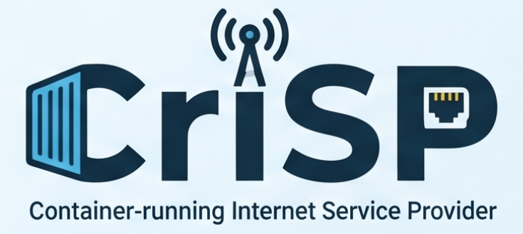

# CrISP - A Container-running Internet Service Provider



> Multi-site enterprise network project with internal routing, interconnection with other autonomous systems, and shared network services.

> **Yoann François - Corentin Pradier - Emilien Fieu - Thomas Silvestre - Nikita Ziuzin - Stéphane Loppinet - Ismail Al Riyami - Pierre Chaveroux**

## Project Overview

This project focuses on building a multi-site enterprise network and setting up an autonomous system that can interconnect with the other ASes used by the class.

### Scope and Project Tracking

| Area | Requirements | Status |
| --- | --- | --- |
| Our AS | Provide Internet access service to individual users (internal and external). | OK |
| Our AS | Offer a zero-configuration interconnection solution for residential clients. | OK |
| Our AS | Internal residential users are our responsibility; client management is handled by the group. | OK |
| Our AS | Residential users (internal or external) must access the network through a consumer gateway (box). | OK |
| Our AS | The internal user is number 2 | OK |
| External AS | The external user is number (2+2)%4 = 0+1, , i.e., AS11 | NOK |
| Our AS | Through their gateway, residential users must be able to automatically access the enterprise network. | OK |
| Our AS | Provide Internet access service to the enterprise network (internal and external). | OK |
| Our AS | The internal company AS number is G2+10 (AS12). | OK |
| Our AS | The external company is managed by Group 3: Sarah, Denisa, Tess, Simon, Nils, Mina, Alex, Louis, and Pierre-François. | NOK |
| Our AS | The connection provided to the company must allow access to both sites: intra-AS12 and external AS13. | NOK |
| Our AS | Use OSPF as the dynamic routing protocol within the AS. | OK |
| Our AS | Our AS12 IP range is 120.0.32.0/20. | OK |
| Enterprise site | Implement network services and dynamic addressing (DHCP). | OK |
| Enterprise site | Implement internal network access security. | NOK |
| Enterprise site | Implement user management. | NOK |
| Enterprise site | Deploy the enterprise DNS service. | OK |
| Enterprise site | Deploy the VoIP service. | OK |
| Enterprise site | Deploy the company's web service. | OK |
| Enterprise site | Set up a VPN between the two company sites. | OK |
| Enterprise site | Set up a VPN between the companies and residential users. | OK |

### Topology


## First launch

```bash
# Create the required host bridges (specify TRUNK_IFACE if using a physical breakout switch trunk)
# Example: TRUNK_IFACE=<your-host-nic> sudo -E ./scripts/create-host-bridges.sh
sudo ./scripts/create-host-bridges.sh

docker build -t reverse-proxy:latest ./web/reverse-proxy
docker build -t web:latest ./web

cd voip
make build
cd ..

# Load the Arista vEOS image (vrnetlab/arista_veos:4.31.0F) — see "Arista vEOS image".
docker load -i arista_veos_4.31.0F.tar.gz
# (or build it yourself: ./scripts/build-veos-image.sh)

sudo containerlab destroy --topo topology.clab.yaml --cleanup
sudo containerlab deploy --topo topology.clab.yaml
```

## Restart after a reboot

```bash
# Setup host bridges (specify TRUNK_IFACE and use connect-breakout-trunk.sh if using physical breakout trunk)
# Example: TRUNK_IFACE=<your-host-nic> sudo -E ./scripts/connect-breakout-trunk.sh
sudo ./scripts/create-host-bridges.sh
sudo containerlab destroy --topo topology.clab.yaml --cleanup
sudo containerlab deploy --topo topology.clab.yaml
```

## DHCP service

The DHCP architecture, configuration details, and end-to-end test procedure are documented in [dhcp/README.md](dhcp/README.md).

## VPN service

The OpenVPN nomad CPE is documented in [vpn/README.md](vpn/README.md). 

## DNS service

The DNS architecture, views/ACL behavior, and validation commands are documented in [dns/README.md](dns/README.md).

## Web service

The web architecture and validation commands are documented in [web/README.md](web/README.md).

## VoIP service

The VoIP architecture and smoke test procedure are documented in [voip/README.md](voip/README.md).

## CRISP service

The CRISP router, DMZ, and private client network are documented in [crisp/README.md](crisp/README.md).

## RADIUS service

A minimal FreeRADIUS server provides user authentication for the AS. Architecture details are in [radius/README.md](radius/README.md).
