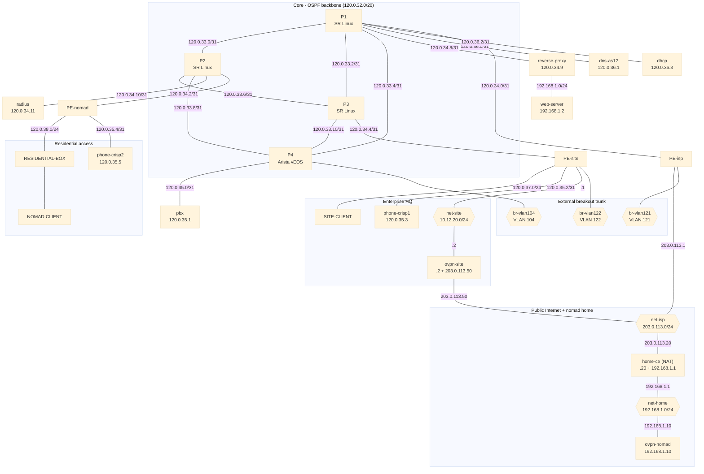
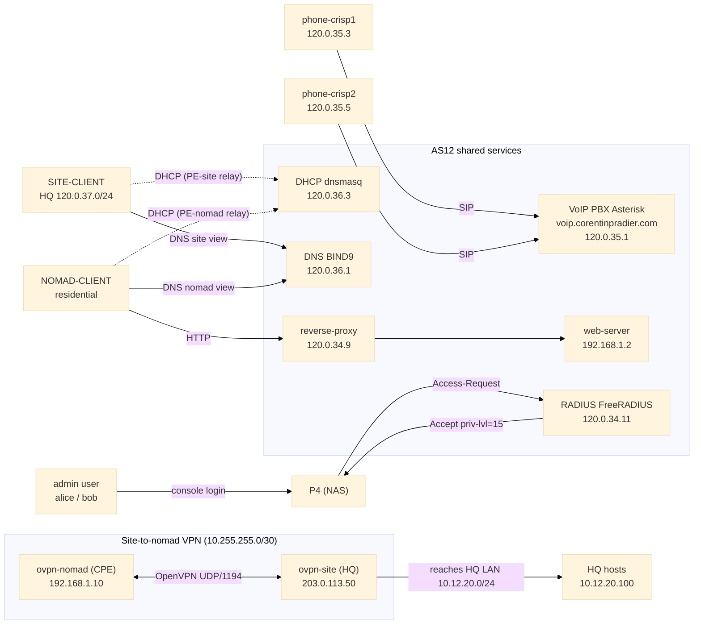

# CrISP - A Container-running Internet Service Provider


> Multi-site enterprise network project with internal routing, interconnection with other autonomous systems, and shared network services.

> **Yoann François - Corentin Pradier - Emilien Fieu - Thomas Silvestre - Nikita Ziuzin - Stéphane Loppinet - Ismail Al Riyami - Pierre Chaveroux**

## Project Overview

This project focuses on building a multi-site enterprise network and setting up an autonomous system that can interconnect with the other ASes used by the class.

### Scope and Project Tracking

| Area | Requirements | Status |
| --- | --- | --- |
| Our AS | Provide Internet access service to individual users (internal and external). | OK |
| Our AS | Offer a zero-configuration interconnection solution for residential clients. | OK |
| Our AS | Internal residential users are our responsibility; client management is handled by the group. | OK |
| Our AS | Residential users (internal or external) must access the network through a consumer gateway (box). | OK |
| Our AS | The internal user is number 2 | OK |
| External AS | The external user is number (2+2)%4 = 0+1, , i.e., AS11 | NOK |
| Our AS | Through their gateway, residential users must be able to automatically access the enterprise network. | OK |
| Our AS | Provide Internet access service to the enterprise network (internal and external). | OK |
| Our AS | The internal company AS number is G2+10 (AS12). | OK |
| Our AS | The external company is managed by Group 3: Sarah, Denisa, Tess, Simon, Nils, Mina, Alex, Louis, and Pierre-François. | NOK |
| Our AS | The connection provided to the company must allow access to both sites: intra-AS12 and external AS13. | NOK |
| Our AS | Use OSPF as the dynamic routing protocol within the AS. | OK |
| Our AS | Our AS12 IP range is 120.0.32.0/20. | OK |
| Enterprise site | Implement network services and dynamic addressing (DHCP). | OK |
| Enterprise site | Implement internal network access security. | NOK |
| Enterprise site | Implement user management. | NOK |
| Enterprise site | Deploy the enterprise DNS service. | OK |
| Enterprise site | Deploy the VoIP service. | OK |
| Enterprise site | Deploy the company's web service. | OK |
| Enterprise site | Set up a VPN between the two company sites. | OK |
| Enterprise site | Set up a VPN between the companies and residential users. | OK |

## First launch

```bash
chmod +x set_bridges
./set_bridges

# Optional: create the extra bridges for the Arista P4 breakout trunk.
# Set TRUNK_IFACE when the host NIC is connected to a physical switch trunk.
TRUNK_IFACE=<your-host-nic> sudo -E ./scripts/create-host-bridges.sh

docker build -t reverse-proxy:latest ./web/reverse-proxy
docker build -t web:latest ./web

cd voip
make build
cd ..

# Load the Arista vEOS image (vrnetlab/arista_veos:4.31.0F) — see "Arista vEOS image".
docker load -i arista_veos_4.31.0F.tar.gz
# (or build it yourself: ./scripts/build-veos-image.sh)

sudo containerlab destroy --topo topology.clab.yaml --cleanup
sudo containerlab deploy --topo topology.clab.yaml
```

## Restart after a reboot

```bash
./set_bridges
TRUNK_IFACE=<your-host-nic> sudo -E ./scripts/connect-breakout-trunk.sh
sudo containerlab destroy --topo topology.clab.yaml --cleanup
sudo containerlab deploy --topo topology.clab.yaml
```

## Arista vEOS image

`P4` runs as Arista vEOS and needs the `vrnetlab/arista_veos:4.31.0F` image present locally. The topology pins `image-pull-policy: Never`, so containerlab never tries to pull it — you must load or build it first.

Load the prebuilt image from the archive shipped with the repo:

```bash
docker load -i arista_veos_4.31.0F.tar.gz
docker images | grep arista_veos      # expect: vrnetlab/arista_veos   4.31.0F
```

Alternatively build it yourself from an EOS image with `./scripts/build-veos-image.sh`. If you use a different tag, override it at deploy time with `VEOS_IMAGE=<repo:tag>`.

## Arista P4 breakout trunk

`P4` runs as Arista vEOS using `configs/P4.eos.cfg`. The default local image tag is `vrnetlab/arista_veos:4.31.0F`; override it during deployment with `VEOS_IMAGE` if needed.

The physical breakout trunk uses Linux VLAN subinterfaces on one host NIC:

| VLAN | Linux interface | Host bridge | Containerlab endpoint |
| --- | --- | --- | --- |
| `104` | `clab104` | `br-vlan104` | `P4:Ethernet4` |
| `121` | `clab121` | `br-vlan121` | `PE-isp:e1-3` |
| `122` | `clab122` | `br-vlan122` | `PE-site:e1-5` |

Run:

```bash
TRUNK_IFACE=<your-host-nic> sudo -E ./scripts/connect-breakout-trunk.sh
```

## Topology overview

### Physical topology

The cabling exactly as wired in `topology.clab.yaml`. Hexagons are host bridges (shared L2 segments); link labels are the subnet (or host octet) on that segment.



### Services

Logical view of who consumes each service. Solid arrows are data paths, dotted arrows are relayed/control traffic.



How it works (short version):

- `P1-P4` is the transport core; services are attached behind PE routers or directly on core edges.
- DNS (`120.0.36.1`) and DHCP (`120.0.36.3`) sit on P1 as separate /31 links; DHCP serves the relayed nomad pool, and `PE-nomad` relays residential clients.
- DNS (`120.0.36.1`) answers with different views depending on client subnet (`10.12.30.0/24` and the VPN CPE `192.168.1.10/32` for intranet, `120.0.38.0/24` for residential, or default/public for everyone else).
- VoIP phones `phone-crisp1` and `phone-crisp2` register to PBX (`120.0.41.5`) and call each other across the CRISP client net.
- VPN links nomad side to CRISP: `ovpn-nomad` reaches `ovpn-site` over public `203.0.113.0/24`, then into the CRISP DMZ (`120.0.40.0/24`) and the protected DNS endpoint (`120.0.36.1`).
- RADIUS (`120.0.34.11`) authenticates router logins; the Arista `P4` is the NAS and maps authenticated users (`alice`/`bob`) to privilege level 15.

### PE-site / CRISP topology

Exact interface addressing for the CRISP head router, its DMZ, and its private client net:

| Link | IPs |
| --- | --- |
| `P3:e1-10` ↔ `PE-site:e1-1` | `P3 = 120.0.34.4/31`, `PE-site = 120.0.34.5/31` |
| `PE-site:e1-4` ↔ `CRISP:e1-1` | `PE-site = 120.0.39.0/31`, `CRISP = 120.0.39.1/31` |
| `CRISP:e1-2` ↔ `net-crisp-dmz` | `CRISP = 120.0.40.1/24`, `ovpn-site = 120.0.40.2/24`, `reverse-proxy = 120.0.40.3/24`, `web-server = 120.0.40.4/24` |
| `CRISP:e1-3` ↔ `net-crisp-srv` | `CRISP = 120.0.41.1/24`, `pbx = 120.0.41.5/24`, `dhcp-crisp = 120.0.41.10/24` |
| `CRISP:e1-4` ↔ `net-crisp-client` | `CRISP = 10.12.30.1/24`, `CRISP-CLIENT = DHCP 10.12.30.100-200/24`, `phone-crisp1 = 10.12.30.101/24`, `phone-crisp2 = 10.12.30.102/24` |

What this means:

- `PE-site` is only the enterprise edge router; it reaches `CRISP` over the `120.0.39.0/31` transit link.
- `CRISP` is the head router for the CRISP site.
- The DMZ on `120.0.40.0/24` hosts `ovpn-site`, `reverse-proxy`, and `web-server`.
- The private services VLAN on `120.0.41.0/24` hosts `pbx` and the CRISP DHCP server.
- The private client net on `10.12.30.0/24` hosts the CRISP client PC and the two softphones.
- `dhcp-crisp` in the DMZ hands out `10.12.30.100-200/24` to the client net, with gateway `10.12.30.1` and DNS `120.0.36.1`.

## DHCP service

The DHCP architecture, configuration details, and end-to-end test procedure are documented in [dhcp/README.md](dhcp/README.md).

## VPN service

The OpenVPN nomad CPE is documented in [vpn/README.md](vpn/README.md). 

## DNS service

The DNS architecture, views/ACL behavior, and validation commands are documented in [dns/README.md](dns/README.md).

## Web service

The web architecture and validation commands are documented in [web/README.md](web/README.md).

## VoIP service

The VoIP architecture and smoke test procedure are documented in [voip/README.md](voip/README.md).

## CRISP service

The CRISP router, DMZ, and private client network are documented in [crisp/README.md](crisp/README.md).

## RADIUS service

A minimal FreeRADIUS server (node `radius`, service IP `120.0.34.11`, hung off `P2`) provides authentication for the AS. Two test users live in `radius/authorize` — `alice`/`alice123` and `bob`/`bob123` — and the shared secret for every NAS client is `testing123`. The Arista router `P4` is configured as a RADIUS client (`configs/P4.eos.cfg`) and authenticates logins against it, mapping users to privilege level 15. Architecture details are in [radius/README.md](radius/README.md).

### Test the server directly

```bash
# Access-Accept for a valid user, Access-Reject for a bad password / unknown user
docker exec clab-enterprise-ospf-bgp-radius radtest alice alice123 127.0.0.1 0 testing123
docker exec clab-enterprise-ospf-bgp-radius radtest alice wrongpw  127.0.0.1 0 testing123
```

Inspect the exact attributes returned (e.g. the privilege level sent to Arista):

```bash
docker exec clab-enterprise-ospf-bgp-radius sh -c \
  'echo "User-Name=alice,User-Password=alice123" | radclient -x 127.0.0.1:1812 auth testing123'
# expect: Access-Accept ... Arista-AVPair = "shell:priv-lvl=15"
```

The service IP is reachable across the AS because its `/31` is advertised in OSPF:

```bash
  docker exec clab-enterprise-ospf-bgp-SITE-CLIENT ping -c2 120.0.34.11
```

### Test from the Arista P4 router

`P4` is reached over its vrnetlab serial console (it has no management IP). Open it with telnet:

```bash
docker exec -it clab-enterprise-ospf-bgp-P4 telnet localhost 5000
```

Log in as the RADIUS user `alice` / `alice123` — you land directly at privilege level 15 (`P4#`):

```text
P4#show privilege                            ! -> Current privilege level is 15
P4#test aaa group radius alice alice123      ! -> "User was successfully authenticated."
P4#test aaa group radius bob  wrongpw        ! -> "Authentication failed"
```

> Note: with `aaa authentication login default group radius local`, EOS only falls back to the local `admin` account when RADIUS is **unreachable** — a RADIUS *reject* is final. Use `alice`/`bob` (privilege 15) as the day-to-day admins; local `admin` is the break-glass login for when the RADIUS server is down. The `aaa authorization serial-console` line in `configs/P4.eos.cfg` is what makes the RADIUS-returned privilege level apply to console logins (EOS disables console authorization by default).
