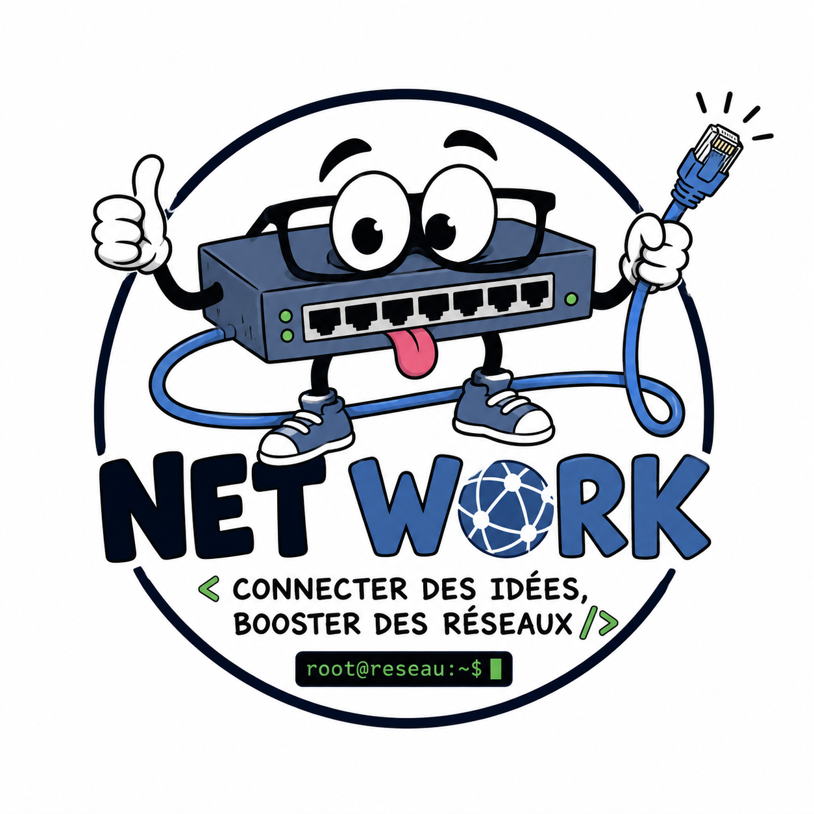

# Enterprise Network



> Multi-site enterprise network project with internal routing, interconnection with other autonomous systems, and shared network services.

## Project Overview

This project focuses on building a multi-site enterprise network and setting up an autonomous system that can interconnect with the other ASes used by the class.

### Team Members

| Name |
| --- |
| Yoann François |
| Corentin Pradier |
| Emilien Fieu |
| Thomas Silvestre |
| Nikita Ziuzin |
| Stéphane Loppinet |
| Ismael Alriyami |
| Pierre Chaveroux |

### Scope

| Area | Requirements |
| --- | --- |
| Our AS | Provide Internet access service to individual users (internal and external). |
| Our AS | Offer a zero-configuration interconnection solution for residential clients. |
| Our AS | Internal residential users are our responsibility; client management is handled by the group. |
| Our AS | Residential users (internal or external) must access the network through a consumer gateway (box). |
| Our AS | The internal user is number 2 |
| External AS | The external user is number (2+2)%4 = 0+1, , i.e., AS11 |
| Our AS | Through their gateway, residential users must be able to automatically access the enterprise network. |
| Our AS | Provide Internet access service to the enterprise network (internal and external). |
| Our AS | The internal company AS number is G2+10 (AS12). |
| Our AS | The external company is managed by Group 3: Sarah, Denisa, Tess, Simon, Nils, Mina, Alex, Louis, and Pierre-François. |
| Our AS | The connection provided to the company must allow access to both sites: intra-AS12 and external AS13. |
| Our AS | Use OSPF as the dynamic routing protocol within the AS. |
| Our AS | Our AS12 IP range is 120.0.162.0/20. |
| Enterprise site | Implement network services and dynamic addressing (DHCP). |
| Enterprise site | Implement internal network access security. |
| Enterprise site | Implement user management. |
| Enterprise site | Deploy the enterprise DNS service. |
| Enterprise site | Deploy the VoIP service. |
| Enterprise site | Deploy the company's web service. |
| Enterprise site | Set up a VPN between the two company sites. |
| Enterprise site | Set up a VPN between the companies and residential users. |

## Project Tracking

### Enterprise Site Tasks

| Task | Status | Completion date |
| --- | --- | --- |
| Network services and dynamic addressing | KO | - |
| Internal network access security | KO | - |
| User management | KO | - |
| Enterprise DNS | KO | - |
| VoIP service | KO | - |
| Enterprise web service | KO | - |
| VPN between company sites | KO | - |
| VPN between company and residential users | KO | - |

### Work Packages

| Team | Members | Iteration Number | Focus | Status |
| --- | --- | --- | --- | --- |
| Team 1 | Ismael & Pierre | 1 | DNS and DHCP setup in the AS | KO |
| Team 2 | Nikita & Stéphane | 1 | VoIP and web Docker setup inside the enterprise | KO |
| Team 3 | Corentin & Emilien | 1 | eBGP interconnection and VPN | KO |
| Team 4 | Yoann & Thomas | 1 |  Internal AS routing | KO |

## Deployment Procedure

1. Clone the repository and move into the project directory.

   ```bash
   git clone https://github.com/yfgrepcat/enterprise-network.git
   cd enterprise-network
   ```

2. Optional: install the Containerlab VS Code extension if you want easier lab management.

   See the official guide: https://containerlab.dev/manual/vsc-extension/

3. Deploy the lab environment with Containerlab.

   Use the CLI if Containerlab is already installed on your system:

   ```bash
   sudo containerlab deploy --topo topology.clab.yaml
   ```

   > Note: `sudo` may be disabled in recent Containerlab setups. If that happens, add your user to the `docker` and `clab_admins` groups so you can run Containerlab without `sudo`.

   Or deploy it from VS Code:

   - Open the Containerlab extension in the VS Code sidebar.
   - Select the `clab-topology.yaml` topology file.
   - Click `Deploy Lab` to start the environment.

## DNS notes (how it works + tests)

The DNS server is a BIND9 container connected to P2.
It uses views:
- enterprise clients get enterprise answers
- residential clients get residential answers
 
CAREFULL : Server IP and ACL are random to switch from a vue to another depending on the IP of the client.

Useful IPs in this lab:
- DNS mgmt IP: 172.20.20.30
- DNS service IP: 120.0.34.7
- www (enterprise): 120.0.35.11
- www (residential/public): 120.0.35.12
- voip: 120.0.35.13

Quick run from repo root:

```bash
sudo containerlab destroy --topo topology.clab.yaml
sudo containerlab deploy --topo topology.clab.yaml
```

Quick host check:

```bash
dig @172.20.20.30 www.enterprise.local 
dig @172.20.20.30 voip.enterprise.local
```

View test (enterprise vs residential):

```bash
# add temporary source IPs inside DNS container
docker exec clab-enterprise-ospf-bgp-dns-as12 ip link add ent0 type dummy
docker exec clab-enterprise-ospf-bgp-dns-as12 ip addr add 120.0.162.10/24 dev ent0
docker exec clab-enterprise-ospf-bgp-dns-as12 ip link set ent0 up

docker exec clab-enterprise-ospf-bgp-dns-as12 ip link add res0 type dummy
docker exec clab-enterprise-ospf-bgp-dns-as12 ip addr add 120.0.164.10/24 dev res0
docker exec clab-enterprise-ospf-bgp-dns-as12 ip link set res0 up

# enterprise source
docker exec clab-enterprise-ospf-bgp-dns-as12 dig -b 120.0.162.10 @120.0.34.7 www.enterprise.local +short

# residential source
docker exec clab-enterprise-ospf-bgp-dns-as12 dig -b 120.0.164.10 @120.0.34.7 www.enterprise.local +short
```

Expected:
- enterprise source returns 120.0.35.11
- residential source returns 120.0.35.12

Cleanup after test:

```bash
docker exec clab-enterprise-ospf-bgp-dns-as12 ip link del ent0
docker exec clab-enterprise-ospf-bgp-dns-as12 ip link del res0
```

Debug commands if needed:

```bash
docker ps --filter "name=dns-as12" --format "{{.Names}}"
docker exec -it $(docker ps --filter "name=dns-as12" -q) bash
named-checkconf /etc/bind/named.conf
named-checkzone enterprise.local /etc/bind/zones/db.enterprise.local
journalctl -u bind9
```
More details are in dns/README.md.

## [Monday, May 18] End-of-session summary

Summary of what was done:

- **Emilien:** OpenSense test failed because it runs in a VM and the version is incompatible. Router image tests: Cisco image not OK; succeeded in generating an Arista image. Next steps: rebuild the topology with a gateway for VPNs. Consider site-to-site VPN design for the next session.

- **Corentin:** Interconnection with Cisco is working. Translate the configuration to Arista (use Emilien's image). Translation task to be completed next session.

- **Stéphane:** Refactored the VoIP code; it's OK. ContainerLab deployment is working. Next time: fix traffic/flow issues observed in ContainerLab.

- **Nikita:** Prepared Docker web service with two instances (same server). Next time: deploy the web instances in ContainerLab so they are ready to plug in.

- **Pierre:** DNS integrated and merged into main. Next: test DNS behavior in real conditions across different networks and with other groups.

- **Ismael:** DHCP integrated into the topology and functional when used directly by a client. Next time: investigate configuring DHCP relay.
