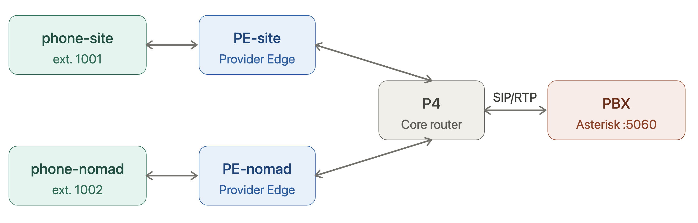

# VoIP

SIP call flow with one Asterisk PBX (server) and 2 softphones (clients).

## Architecture

### Files

```
voip/
  Makefile                    Build all Docker images; attach to phone consoles.
  asterisk/
    Dockerfile                Builds the Asterisk PBX image (asterisk + config).
    sip.conf                  SIP peer definitions — ext. 1001, 1002 (topology phones)
                              and 1003 (external client), dynamic host, ulaw/alaw codecs.
    extensions.conf           Dial plan — Dial(SIP/100x, 30s) for each extension.
  client/
    Dockerfile                Builds the baresip softphone image (topology phones).
    entrypoint.sh             Auto-configures baresip at startup: reads SIP_USER /
                              SIP_SERVER / SIP_PASS env vars, detects local IP on
                              eth1, writes accounts + config, then registers to PBX.
  external-client/
    Dockerfile                Builds the standalone baresip image for an off-topology machine.
    entrypoint.sh             Same as client but detects outbound IP via ip route get
                              (no eth1 assumption). Registers as ext. 1003.
    docker-compose.yml        Ready-to-run compose file (network_mode: host, ext. 1003).
```

### Network topology

Outdated:


The PBX runs in the CRISP SVC VLAN (`120.0.41.5/24`). Both phones sit in the CRISP LAN (`10.12.30.0/24`) and reach the PBX through the CRISP router.

## How it works

- `pbx` runs Asterisk with SIP users `1001`, `1002`, and `1003`
- `phone-crisp1` registers as `1001` to `voip.corentinpradier.com`
- `phone-crisp2` registers as `1002` to `voip.corentinpradier.com`
- `phone-external` registers as `1003` from an off-topology machine

Topology service links:

- `pbx` on `120.0.41.5/24` in the CRISP SVC VLAN
- `phone-crisp1` on `10.12.30.101/24` via `CRISP`
- `phone-crisp2` on `10.12.30.102/24` via `CRISP`

## Registration

Phones register automatically on startup (`regint=3600`, re-registers every 3600 s).

Check registration status from a phone console:

```text
/reginfo
```

## Test

Open both phone consoles in separate terminals:

```bash
cd voip
make phone-crisp1
```

```bash
cd voip
make phone-crisp2
```

Both phones auto-register on startup. Verify with `/reginfo` before calling.

From `phone-crisp1`, place the call:

```text
/dial 1002
```

From `phone-crisp2`, answer:

```text
/accept
```

End the call from either side:

```text
/hangup
```

Detach from a phone console without stopping it: `Ctrl+C`.

Expected results:

* Phone1: 

```bash
t70n@t70n-workstation:~/Documents/crisp$ cd voip
make phone-crisp1
docker attach --detach-keys="ctrl-c" clab-enterprise-ospf-bgp-phone-crisp1
/dial 1002
ua: using best effort AF: af=AF_INET
call: connecting to 'sip:1002@voip.corentinpradier.com;transport=udp'..
call: SIP Progress: 100 Trying (/)
call: SIP Progress: 180 Ringing (/)
stream: update 'audio'
audio: Set audio decoder: PCMU 8000Hz 1ch
audio: Set audio encoder: PCMU 8000Hz 1ch
audio tx pipeline:       (src) ---> PCMU
audio rx pipeline:      (play) <--- PCMU
1001@voip.corentinpradier.com: Call established: sip:1002@voip.corentinpradier.com;transport=udp
call: got re-INVITE (SDP Offer)
stream: update 'audio'
ua: using best effort AF: af=AF_INET
/hangup5] audio=0/0 (bit/s)    
call: terminate call '408347f913a34eaa' with sip:1002@voip.corentinpradier.com;transport=udp
sip:1001@voip.corentinpradier.com: Call with sip:1002@voip.corentinpradier.com;transport=udp terminated (duration: 5 secs)
read escape sequence
make: *** [Makefile:6: phone-crisp1] Error 1
t70n@t70n-workstation:~/Documents/crisp/voip$ 
```

* Phone2: 

```bash
t70n@t70n-workstation:~/Documents/crisp$ cd voip
make phone-crisp2
docker attach --detach-keys="ctrl-c" clab-enterprise-ospf-bgp-phone-crisp2
ua: using AF from sdp offer: af=AF_INET
sip:1002@voip.corentinpradier.com: Incoming call from: Phone1 sip:1001@120.0.41.5 - (press 'a' to accept)
/accept
sip:1002@voip.corentinpradier.com: Answering incoming call
call: answering call on line 1 from sip:1001@120.0.41.5 with 200
stream: update 'audio'
audio: Set audio decoder: PCMU 8000Hz 1ch
audio: Set audio encoder: PCMU 8000Hz 1ch
audio tx pipeline:       (src) ---> PCMU
audio rx pipeline:      (play) <--- PCMU
1002@voip.corentinpradier.com: Call established: sip:1001@120.0.41.5
call: got re-INVITE (SDP Offer)
stream: update 'audio'
ua: using best effort AF: af=AF_INET
call: got re-INVITE (SDP Offer)
stream: update 'audio'
sip:1001@120.0.41.5: session closed: Connection reset by peer
sip:1002-0x5629afb1fcf0@10.12.30.102:5060: Call with sip:1001@120.0.41.5 terminated (duration: 5 secs)
read escape sequence
make: *** [Makefile:9: phone-crisp2] Error 1
t70n@t70n-workstation:~/Documents/crisp/voip$ 
```

## External client (ext. 1003)

### Prerequisites

The external machine must be able to reach the PBX at `120.0.41.5` (CRISP SVC VLAN).

DNS resolution of `voip.corentinpradier.com` requires the topology DNS server (`120.0.36.1`) to be reachable. 

Add it to the host's resolver if no DNS is set on the host (should not append with great DHCP configuration)

```bash
echo "nameserver 120.0.36.1" | sudo tee /etc/resolv.conf
```

Alternatively, skip DNS by setting `SIP_SERVER=120.0.41.5` directly in `docker-compose.yml`.

### Build and deploy

Docker Compose directly:

```bash
cd voip/external-client
docker compose up -d
```

### Interact

```bash
docker attach phone-external
```

```text
/reginfo       — check registration status
/dial 1001     — call phone-crisp1
/dial 1002     — call phone-crisp2
/hangup        — end the current call
```