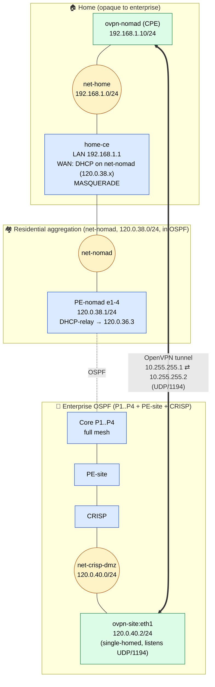

# OpenVPN — Nomad CPE → HQ

This subtree contains the OpenVPN pieces of the lab. The model is a
**pre-configured nomad CPE** that a user plugs into their home internet box
(here: a NAT'd CE we simulate with `home-ce`). The CPE dials the **CRISP
concentrator** which sits single-homed in the CRISP DMZ. There is no
dedicated public IP — the AS IGP delivers the UDP/1194 packets all the way
to the DMZ listener. The enterprise IGP does **not** carry the nomad's
home network.

## Layout



## Files

| File          | Role |
|---------------|------|
| `openvpn/nomad.conf` | CPE config — client/initiator. `nobind`, `remote 120.0.40.2 1194`. |
| `openvpn/site.conf`  | HQ config — server/listener bound to `120.0.40.2:1194`, `float` (NAT survival). |
| `openvpn/static.key` | Shared pre-shared key. Static-key mode = single peer. |

Mode is `secret` (static key, no PKI). Fine for one CPE; if you ever ship a
second box, migrate to TLS with per-CPE certs.

`cipher none` / `auth none` is set for lab readability — packets are
clear-text on the wire so you can read them in Wireshark. **Do not run this
in production.**

## Addressing

| Prefix              | Where                                              | In OSPF? |
|---------------------|----------------------------------------------------|----------|
| `203.0.113.0/24`    | `net-isp` — eBGP-facing public segment             | **No** (opaque to the enterprise; no VPN traffic here) |
| `192.168.1.0/24`    | `net-home` — nomad's home LAN behind the CE        | **No** (opaque to everyone but `home-ce` / CPE) |
| `120.0.38.0/24`     | Residential aggregation `net-nomad` (home-ce WAN)  | Yes (passive on PE-nomad) |
| `120.0.37.0/24`     | Enterprise client LAN on `net-site`                | Yes (passive on PE-site) |
| `120.0.40.0/24`     | CRISP DMZ on `net-crisp-dmz` (ovpn-site/proxy/web) | Yes (passive on CRISP) |
| `120.0.41.0/24`     | CRISP private services VLAN on `net-crisp-srv`     | Yes (passive on CRISP) |
| `10.12.30.0/24`     | CRISP private client net                           | Yes (passive on CRISP) |
| `10.255.255.0/30`   | Tunnel inner — `.1` nomad CPE, `.2` CRISP side     | Static on PE-site **and** CRISP → `ovpn-site` (120.0.40.2) |

## Why it matches the "pre-configured CPE" philosophy

- The nomad box has **no enterprise knowledge** at boot — only its CE gateway
  and the HQ endpoint. Ship it, plug it in, done.
- It **initiates** the tunnel (it has to — it's behind NAT, can't be a
  listener).
- The HQ side is a single-homed DMZ host (`120.0.40.2`) reached through the
  AS IGP. No public-IP middleman; in a real corporate edge this would be a
  DNAT on the border router, but in the lab the IGP delivers UDP/1194
  end-to-end.
- The enterprise IGP does not advertise the nomad LAN. `home-ce` MASQUERADEs
  the home LAN behind its DHCP-assigned `net-nomad` address before traffic
  enters the AS.
- `float` on the HQ side absorbs source-IP/port changes that happen when the
  CE NAT rebinds — typical for a roaming/dynamic-IP CPE.

## Deploy

From the repo root (one level up):

```bash
sudo containerlab deploy --topo topology.clab.yaml
```

This builds the bridges (`net-isp`, `net-site`, `net-home`, `net-crisp-dmz`, `net-crisp-srv`), brings up the
SR Linux routers, the Linux nodes (`ovpn-nomad`, `ovpn-site`, `home-ce`,
`dhcp-crisp`, `pbx`, …) and runs the `exec` lines that install `openvpn` / `iptables`
and start the tunnel daemon.

## Verify

### 1. Tunnel up on both ends

```bash
docker exec clab-enterprise-ospf-bgp-ovpn-site  ip -br a show tun0
docker exec clab-enterprise-ospf-bgp-ovpn-nomad ip -br a show tun0
```

You should see `10.255.255.2/32` (HQ) and `10.255.255.1/32` (nomad).

### 2. Inner ping across the tunnel

```bash
docker exec clab-enterprise-ospf-bgp-ovpn-nomad ping -c 3 10.255.255.2
docker exec clab-enterprise-ospf-bgp-ovpn-site  ping -c 3 10.255.255.1
```

### 3. CPE reaches an HQ host

The reverse-proxy lives in the CRISP DMZ at `120.0.40.3`. From the CPE:

```bash
docker exec clab-enterprise-ospf-bgp-ovpn-nomad ping -c 3 120.0.40.3   # DMZ (web/proxy/PBX)
docker exec clab-enterprise-ospf-bgp-ovpn-nomad ping -c 3 10.12.30.1   # CRISP client-net gateway
docker exec clab-enterprise-ospf-bgp-ovpn-nomad nslookup intranet.corentinpradier.com 120.0.36.1
docker exec clab-enterprise-ospf-bgp-ovpn-nomad wget -qO- --header="Host: intranet.corentinpradier.com" http://120.0.40.3 | grep -m1 "Connexion Intranet"
```

The CPE pulls `120.0.40.0/24` and `10.12.30.0/24` over the tunnel (see
`openvpn/nomad.conf`). The return path uses the CRISP static
`10.255.255.0/30 → 120.0.40.2` (`ovpn-site` DMZ leg), which sends the reply
back into the tunnel.

The tunnel also carries `120.0.36.1` so the nomad CPE can resolve the
intranet hostname before reaching the protected web vhost.

The protected intranet lookup should succeed from the VPN CPE and the CRISP
employee client, but not from `NOMAD-CLIENT`.

```bash
docker exec clab-enterprise-ospf-bgp-ovpn-nomad sh -lc 'nslookup intranet.corentinpradier.com 120.0.36.1'
docker exec clab-enterprise-ospf-bgp-ovpn-nomad sh -lc 'wget -qO- --header="Host: intranet.corentinpradier.com" http://120.0.40.3 | grep -m1 "Connexion Intranet"'
docker exec clab-enterprise-ospf-bgp-CRISP-CLIENT sh -lc 'nslookup intranet.corentinpradier.com 120.0.36.1'
docker exec clab-enterprise-ospf-bgp-NOMAD-CLIENT sh -lc 'nslookup intranet.corentinpradier.com 120.0.36.1 || true'
```

### 4. Sanity-check the public side stays opaque

From a core router (e.g. `P4`), there should be **no** route to
`203.0.113.0/24` or `192.168.1.0/24`:

```bash
docker exec clab-enterprise-ospf-bgp-P4 sr_cli \
  "show network-instance default route-table ipv4-unicast summary" \
  | grep -E '203\.0\.113|192\.168\.1' || echo 'opaque as expected'
```

### 5. Watch the encapsulation

The outer UDP no longer crosses `net-isp`. Catch it where it enters the AS
(on the `net-nomad` residential bridge, just past `home-ce`'s NAT) or where
it lands at the listener (`ovpn-site:eth1`):

```bash
# Inbound side: after home-ce's MASQUERADE, before PE-nomad routes it on
sudo tcpdump -n -i net-nomad 'udp port 1194'

# Listener side: traffic arriving at the DMZ host
docker exec clab-enterprise-ospf-bgp-ovpn-site tcpdump -ni eth1 'udp port 1194'
```

You'll see `120.0.38.<dhcp>:<random>  ↔  120.0.40.2:1194` — the CPE's source
is the CE's WAN IP on `net-nomad` (post-MASQUERADE), exactly as a real CPE
behind NAT, and the destination is the DMZ listener.

## Tear down

```bash
sudo containerlab destroy --topo topology.clab.yaml
```
