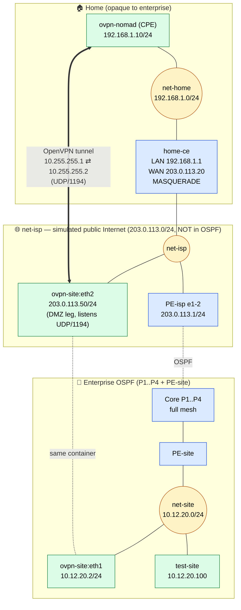

# OpenVPN — Nomad CPE → HQ

This subtree contains the OpenVPN pieces of the lab. The model is a
**pre-configured nomad CPE** that a user plugs into their home internet box
(here: a NAT'd CE we simulate with `home-ce`). The CPE dials the **HQ
concentrator** sitting in a DMZ at a stable public IP. The enterprise IGP
does **not** carry the nomad's network.

## Layout



## Files

| File          | Role |
|---------------|------|
| `openvpn/nomad.conf` | CPE config — client/initiator. `nobind`, `remote 203.0.113.50 1194`. |
| `openvpn/site.conf`  | HQ config — server/listener bound to `203.0.113.50:1194`, `float` (NAT survival). |
| `openvpn/static.key` | Shared pre-shared key. Static-key mode = single peer. |

Mode is `secret` (static key, no PKI). Fine for one CPE; if you ever ship a
second box, migrate to TLS with per-CPE certs.

`cipher none` / `auth none` is set for lab readability — packets are
clear-text on the wire so you can read them in Wireshark. **Do not run this
in production.**

## Addressing

| Prefix              | Where                                              | In OSPF? |
|---------------------|----------------------------------------------------|----------|
| `203.0.113.0/24`    | `net-isp` — simulated public Internet              | **No** (opaque to the enterprise) |
| `192.168.1.0/24`    | `net-home` — nomad's home LAN behind the CE        | **No** (opaque to everyone but `home-ce` / CPE) |
| `10.12.20.0/24`     | HQ LAN on `net-site`                               | Yes (passive on PE-site) |
| `10.255.255.0/30`   | Tunnel inner — `.1` nomad CPE, `.2` HQ side        | Static on PE-site → `ovpn-site` |

## Why it matches the "pre-configured CPE" philosophy

- The nomad box has **no enterprise knowledge** at boot — only its CE gateway
  and the HQ public IP. Ship it, plug it in, done.
- It **initiates** the tunnel (it has to — it's behind NAT, can't be a
  listener).
- The HQ side is a stable public endpoint reachable through the ISP edge.
- The enterprise IGP does not advertise the nomad LAN. The carrier
  (`net-isp`) doesn't know the private prefixes either. The tunnel is the
  only path between the two networks.
- `float` on the HQ side absorbs source-IP/port changes that happen when the
  CE NAT rebinds — typical for a roaming/dynamic-IP CPE.

## Deploy

From the repo root (one level up):

```bash
sudo containerlab deploy --topo topology.clab.yaml
```

This builds the bridges (`net-isp`, `net-site`, `net-home`), brings up the
SR Linux routers, the Linux nodes (`ovpn-nomad`, `ovpn-site`, `home-ce`,
`test-site`, …) and runs the `exec` lines that install `openvpn` / `iptables`
and start the tunnel daemon.

## Verify

### 1. Tunnel up on both ends

```bash
docker exec clab-enterprise-ospf-bgp-ovpn-site  ip -br a show tun0
docker exec clab-enterprise-ospf-bgp-ovpn-nomad ip -br a show tun0
```

You should see `10.255.255.2/32` (HQ) and `10.255.255.1/32` (nomad).

### 2. Inner ping across the tunnel

```bash
docker exec clab-enterprise-ospf-bgp-ovpn-nomad ping -c 3 10.255.255.2
docker exec clab-enterprise-ospf-bgp-ovpn-site  ping -c 3 10.255.255.1
```

### 3. CPE reaches an HQ host

`test-site` lives on the HQ LAN at `10.12.20.100`. From the CPE:

```bash
docker exec clab-enterprise-ospf-bgp-ovpn-nomad ping -c 3 10.12.20.100
```

The return path uses the PE-site static `10.255.255.0/30 → 10.12.20.2`.

### 4. Sanity-check the public side stays opaque

From a core router (e.g. `P4`), there should be **no** route to
`203.0.113.0/24` or `192.168.1.0/24`:

```bash
docker exec clab-enterprise-ospf-bgp-P4 sr_cli \
  "show network-instance default route-table ipv4-unicast summary" \
  | grep -E '203\.0\.113|192\.168\.1' || echo 'opaque as expected'
```

### 5. Watch the encapsulation

On the host, capture the outer UDP on the public bridge:

```bash
sudo tcpdump -n -i net-isp 'udp port 1194'
```

You'll see `203.0.113.20:<random>  ↔  203.0.113.50:1194` — the CPE's source
is the CE's WAN IP (post-MASQUERADE), exactly as a real CPE behind NAT.

## Tear down

```bash
sudo containerlab destroy --topo topology.clab.yaml
```
